<p align="center">
  
</p>

<h1 align="center">PadForge</h1>

*"And we talk of Christ, we rejoice in Christ, we preach of Christ, we prophesy of Christ, and we write according to our prophecies, that our children may know to what source they may look for a remission of their sins."* — 2 Nephi 25:26

*Glory, honor, and praise to the Lord Jesus Christ, the source of all truth, forever and ever.*

---

<p align="center">
  <a href="https://github.com/hifihedgehog/PadForge/actions/workflows/build.yml"></a>
  <a href="https://somsubhra.github.io/github-release-stats/?username=hifihedgehog&repository=PadForge"></a>
  <a href="https://discord.gg/qawTZHVhNH"></a>
  <a href="https://padforge.org/"></a>
  <a href="https://github.com/hifihedgehog"></a>
  <a href="https://x.com/hifihedgehog"></a>
</p>

**PadForge makes any input look like any controller.** Plug in a steering wheel. The game sees a PlayStation pad. Use a DualSense. The game sees an Xbox 360. Map your keyboard. The game sees a flight stick. Open a tab on your phone. That tab becomes a gamepad your PC games can use.

Free Windows app. No subscription. No paywall. No nag screens. Built on SDL3, [HIDMaestro](https://github.com/hifihedgehog/HIDMaestro), [OpenXInput](https://github.com/hifihedgehog/OpenXinput), HidHide, Windows MIDI Services, HelixToolkit, WPF UI, and .NET 10.

PadForge is for sim racers running wheels in games that only understand Xbox controllers. For DualSense owners who want adaptive triggers and lightbar effects in Steam games that ignore them. For accessibility users mapping whatever hardware they can use. For anyone whose controller doesn't match what their game expects.

> **New in 3.5.** Six headline additions. **Wii Bluetooth controllers** pair from inside PadForge. A Wii controller's PIN is six raw bytes set by the sync button you press, not text you can type into the Windows pairing prompt. Press the red SYNC button under the battery cover and the controller bonds, so it reconnects on any button press afterward. The Wii Remote, Remote plus Nunchuk, Classic Controller, and Wii U Pro Controller map as normal pads, with accelerometer and Wii Motion Plus gyro flowing through the existing motion pipeline. **Mouse cursor position** joins the mapping sources: Mouse Position X and Y read the absolute desktop cursor and drive a stick, trigger, or button, each with its own Sensitivity. **Shift layers** now run on six activation modes (Hold, Toggle, Latch, Cycle, Sticky, No Button), with a Cycle queue where one button steps forward and a second steps back through the same list of layers. **Trigger Routing** feeds the main rumble motors into the trigger motors per trigger, reaching both Xbox impulse triggers and DualSense Adaptive Trigger Vibration. **Ramp** turns two held keyboard keys into a smooth analog axis, and every mapping's primary source now picks a Kind: Direct, Incremental, Invert On Hold, or Ramp. **Macro quality-of-life** adds duplicate, copy and paste across virtual controllers, and copy-from-another-controller, plus mouse-cursor macro actions that recenter, pin, or fence the pointer. Carrying forward from 3.4: Remote Link controller sharing across PCs, native wheel force feedback for Logitech, Fanatec, and Thrustmaster, MIDI input as a mapping source, and controller speaker audio on the DualSense and DualShock 4. [Wiki](https://github.com/hifihedgehog/PadForge/wiki).

<p align="center">
  <a href="https://github.com/hifihedgehog/HIDMaestro">
    <picture>
      <source media="(prefers-color-scheme: dark)" srcset="screenshots/hidmaestro-logo-dark.png">
      
    </picture>
  </a>
  <br>
  <em>Powered by HIDMaestro. One driver, 225+ device profiles.</em>
</p>

---

## What PadForge does for you

### That game that won't read your wheel? It will now.

PadForge translates a PS5 DualSense into the Xbox pad a Steam game expects. A Logitech G29 wheel into the gamepad a racing game accepts. A Saitek HOTAS into the gamepad a flight game stubbornly insists on. The game never knows the difference.


### Your wheel fights back.

Plug a Logitech, Fanatec, or Thrustmaster wheel into a slot and PadForge drives its force feedback in the wheel's own native protocol: constant force plus spring, damper, and friction straight from the game. A dedicated Wheel tab sets rotation range in degrees, auto-center strength, and the RPM shift LEDs. A racing game that only knows how to talk to an Xbox pad now loads your wheel up with real road feel.

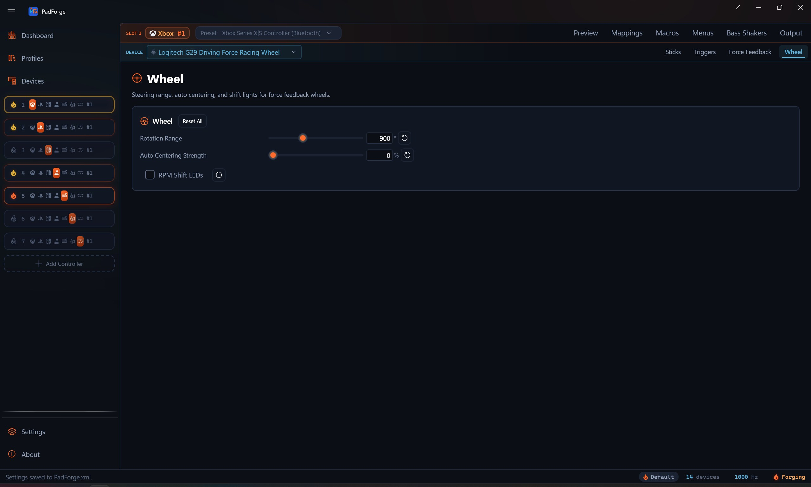

### Pedals, wheel, and HOTAS throttle. One virtual stick.

One mapping row can read from any number of physical inputs across any number of physical devices. Six combine modes (Strongest, Combined, Average, Either, Both, Only one) plus a drag-and-drop custom formula editor. Cross-device chords so a button on the wheel and a button on the shifter trigger one virtual press. A Primary Mode dropdown sets how the main source reads: Direct, Incremental, Invert On Hold, or Ramp. Ramp builds a stick axis from two keyboard keys. The Up key drives toward +1 and the Down key toward -1, each over an Attack time. Release ramps back to center over a Release time when Autocenter is on, or holds where you left it when off. A Reverse multiplier sets how fast it returns when you press the opposite key.


### Caps Lock for your controller.

Each slot can carry extra mapping tables that turn on while a button, chord, or axis fires. Six activation modes: Hold, Toggle, Latch, Cycle, Sticky, and No Button. Latch presses a layer on and leaves it on. Press it again for Base, or press a different Latch button to switch. Cycle puts a queue of layers under one control. The activator steps forward, a second Previous button steps back through the same list, and that Previous button can sit on another device. Wrap Around loops past the last layer to the first. Include Base folds the resting layer into the rotation or leaves it out. A No Button layer has no activator of its own and exists only to ride a Cycle queue. Each layer carries its own color and emoji icon, and a Win11-style flyout confirms the active layer the moment it engages.


### Aim with the controller, not the stick.

Reference frames (Local, Player, World). Dual-threshold smoothing. Real-world calibration. A cross-device Aim Engage button, plus a stick gate that wakes the gyro from any stick and any direction, read before the stick's own deadzone so a nudge the game ignores still arms it. Tuning saves per pad per slot, so the same pad on two slots can feel two different ways. Gyro Pitch / Yaw / Roll bind as first-class sources in the mapping table.

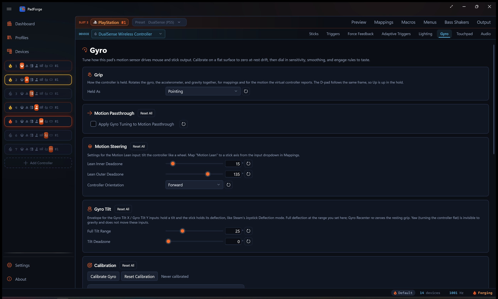

### Move the mouse, move the stick.

Two new mapping sources, Mouse Position X and Mouse Position Y, read where the desktop cursor sits on screen. Center reads zero, and distance from center pushes the stick toward its edge. (That differs from the Mouse Speed X/Y sources, which read how fast the mouse moves.) Each row using a Mouse Position source gets its own Sensitivity, from 0.1 to 5.0. At 1.0 the stick reaches full deflection when the cursor sits 10% of the screen width from center. Raise it for less cursor travel, lower it for more. A Mouse Position source can drive a stick axis, a trigger, or a button. Primary monitor only.


### Forza, Gears, and Halo on your real Xbox pad.

PadForge passes Xbox impulse trigger data straight to the assigned physical Xbox One, Elite, or Series pad. The same data routes to DualSense as Adaptive Trigger Vibration so a DualSense playing Forza buzzes the triggers in step with an Xbox One pad doing the same. Plus audio-bass-driven trigger rumble and a constant trigger force that resumes when the game stops.

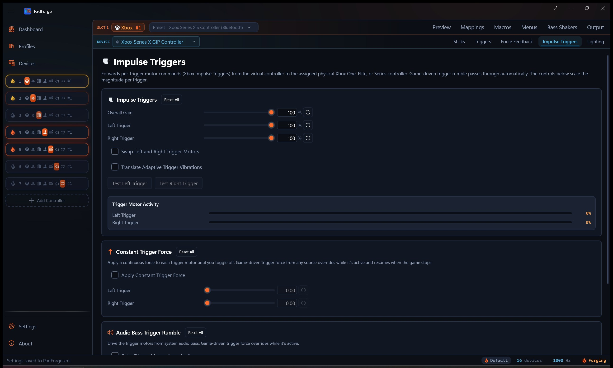

### Adaptive triggers and lightbar that don't need the game's blessing.

Seven adaptive trigger modes with a live preview that draws the resistance curve as you drag. Fifteen lightbar modes, six of them tied to your system audio (three Audio Pulse variants, three Audio Bands variants). The DualSense lights and triggers light up in games that have never heard of a DualSense.

| 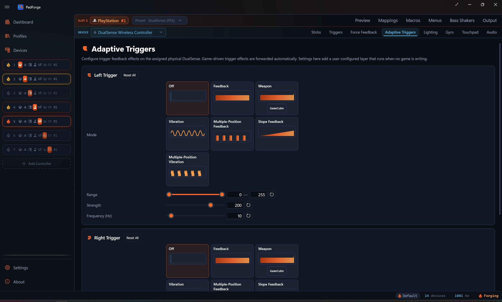 |  |
|:---:|:---:|

### Sound from the speaker in your hands.

The DualSense and DualShock 4 have a speaker built into the pad, and PadForge can drive it. Mirror a Windows audio output to the pad, or send a slot's macro sounds straight to it. The DualSense plays over USB or Bluetooth. The DualShock 4 plays over Bluetooth. Each speaker-capable pad gets its own per-slot Audio tab, with a source picker and a master volume. Controllers with haptic actuators instead of a speaker (Joy-Con, Switch Pro, the Steam Controller, the Steam Deck, and the Steam Controller 2026) play the same macro sounds as a vibrating tone, so beeps and short cues come through the grip. A Wii Remote plays them through its own speaker.

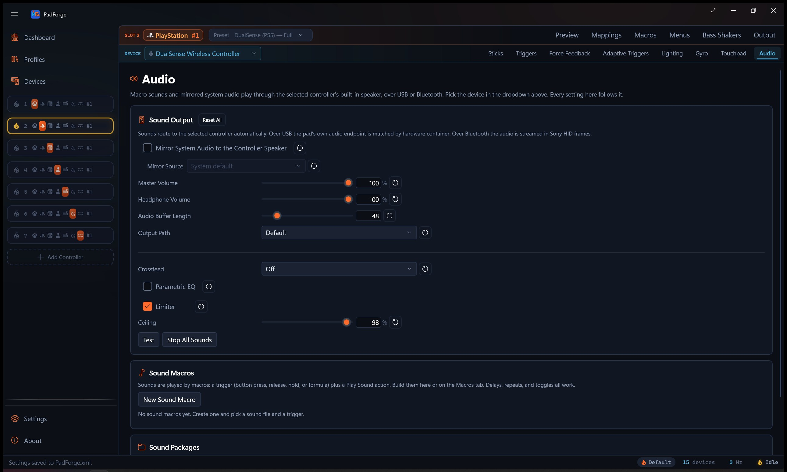

### Turn the DualSense pad into a mouse, a stick, or a D-pad.

A Touchpad tab on every slot whose source carries a touchpad surface (DualSense, DualSense Edge, DS4, Web Controller, on-screen Touchpad Overlay, Windows Precision Touchpad). Map a finger to mouse X/Y with per-axis sensitivity and invert. Anchor a virtual analog stick where your finger lands. Drop a wedge-thresholded D-pad on top. The gesture stack covers 4-way and 8-way swipes, taps, longpress, pinch, rotate, two- to five-finger gestures, and shape templates (Square, Triangle, Z, Checkmark, and Circle in either direction). Every toggle saves per slot.

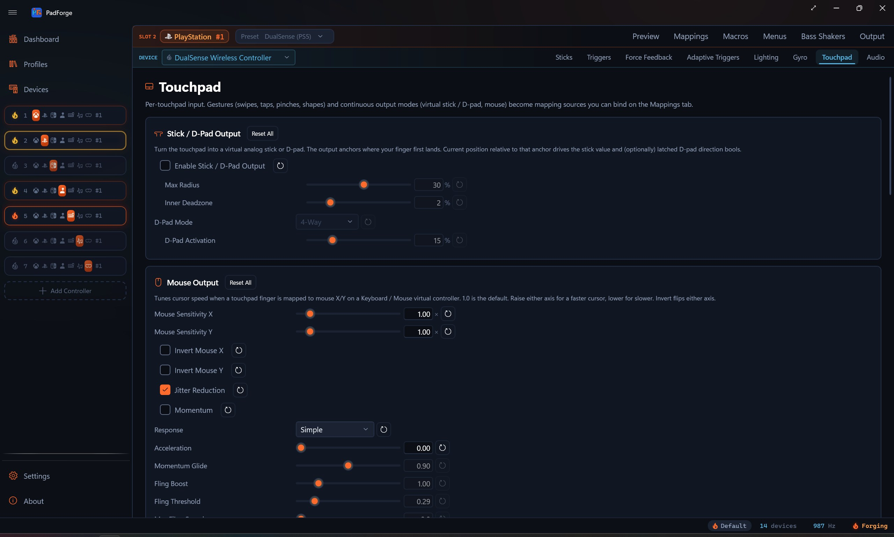

### Open a browser. Press buttons.

PadForge runs a tiny web server. Any device with a browser on your Wi-Fi can load it, pick a layout (Xbox 360, DualShock 4, or multi-touch touchpad), and play. Up to 16 phones at once, each a separate virtual pad. Touch buttons, dual analog sticks, an 8-way D-pad. Rumble feedback through the Vibration API. No app to install on the phone.

No phone handy? Turn on **Touchpad Overlay** from the Dashboard. A transparent on-screen touch surface pins to any monitor and drives the DS4 or DualSense touchpad directly.


### Local co-op without limits.

Two sim racers on two wheels at once. A flight stick plus throttle plus rudder pedals as one virtual HOTAS. Mixed gamepad types in one session. Up to 16 controllers. One combo press toggles every virtual controller on or off when you need to step away.

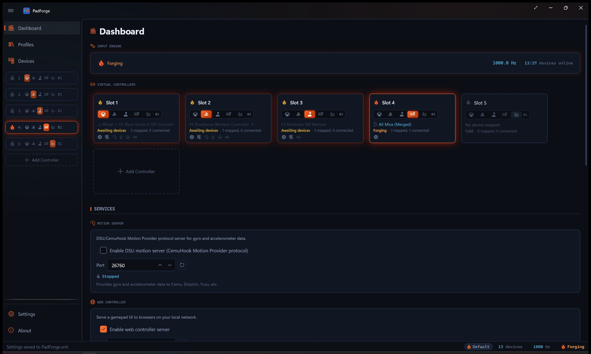

### Pair a Wii Remote over Bluetooth, in-app.

A Wii controller's Bluetooth PIN is six raw bytes, not a string, and it changes with which sync button you press. The Windows pairing prompt can't supply that, so PadForge runs the pairing itself. Open the Devices page, click **Pair**, and press the red SYNC button under the battery cover. The controller bonds, so it reconnects on any button press from then on. (Hold 1 and 2 instead for a temporary pairing that lasts the session.) The Wii Remote, Remote plus Nunchuk, Classic Controller, and Wii U Pro Controller all map as normal pads through SDL. Accelerometer and Wii Motion Plus gyro run through the gyro pipeline, so gyro-to-mouse, gyro-to-stick, and motion mapping work. Swap a Nunchuk on or off mid-session and PadForge re-identifies it without a restart. Needs a Bluetooth radio on the PC. A new Pointer tab turns the Wii Remote's IR camera into an on-screen pointer you can map to a stick or the mouse, and a Wii Balance Board reports total weight and left-right / front-back lean as mapping sources.

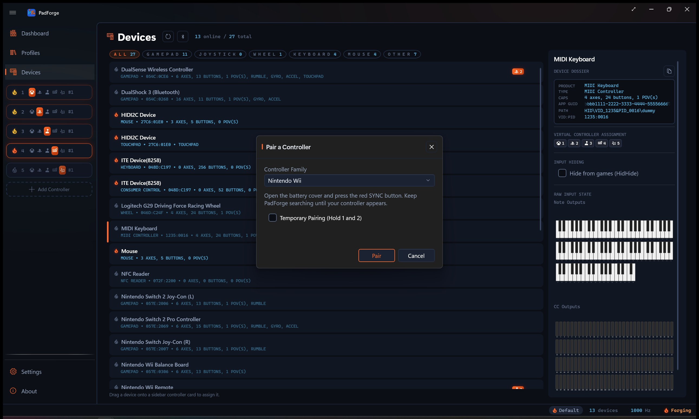

### The controller is on the other PC. The game doesn't care.

Remote Link shares devices across the PadForge PCs on your network. A controller, wheel, or HOTAS plugged into one PC shows up in another's PadForge as an ordinary mapping source, takes a slot, and drives a virtual controller the game reads as real hardware. Connect as many PCs as you like, and one shared controller can drive games on several of them at once. It runs both directions at once, and the feedback comes home: rumble, force feedback, adaptive triggers, lightbar, player LEDs, and the controller speaker all play on the physical device wherever it lives. Pair once by matching a six-digit code on both screens, then trusted PCs reconnect on their own the moment they see each other. A gamepad-only switch keeps a paired PC from ever reaching your keyboard, mouse, or macros. It finds PCs on your home network on its own, and reaches across the internet when the PCs share a VPN like ZeroTier.

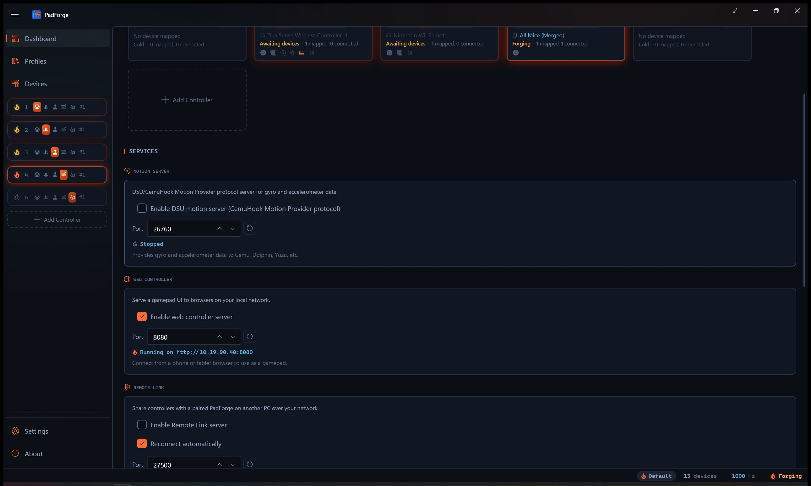

### Gyro into Cemu, Dolphin, Yuzu, and Ryujinx.

The built-in DSU / Cemuhook server broadcasts gyroscope and accelerometer on UDP port 26760 so emulators can use real motion for Splatoon, Wii titles, 3DS games, and anything else that asks for it. DualSense, DualShock 4, Switch Pro, and 2026 Steam Controller sources all work out of the box.


### A 16-channel MIDI controller, no extra hardware.

Map sticks to Control Change messages. Map buttons to Note On / Note Off. Set velocity per slot. PadForge creates a real Windows MIDI endpoint through Windows MIDI Services that DAWs (Ableton Live, FL Studio, Reaper), VJ tools, and stage lighting apps can subscribe to. No loopMIDI bridge.


### A MIDI keyboard as a controller.

PadForge reads MIDI input devices as mapping sources too. Notes, Control Change knobs, pitch bend, and encoder dials from a MIDI keyboard or pad controller bind in the mapping table like any button or axis, so a piano key can press A and a mod wheel can pull a trigger. It rides the same Windows MIDI Services stack the virtual output uses. No bridge software.

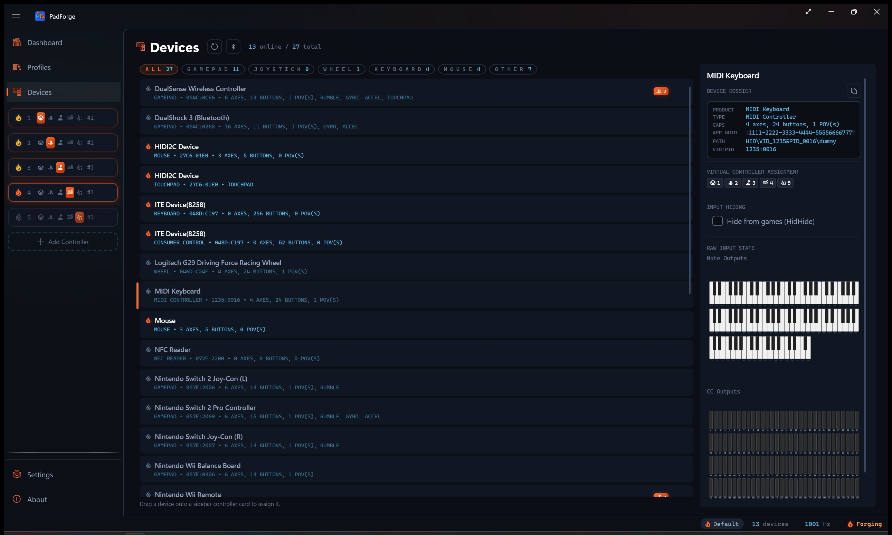

### Tap a tag. Fire a macro.

Plug in an NFC reader (any PC/SC contactless reader, like an ACR122U) and a tag tap runs a macro. Register a tag from the Devices page: hold it on the reader, give it a name, and it is saved for good. Each tag becomes its own trigger, next to an Any NFC Tag trigger that any tag fires. Map an amiibo, a sticker, or a card to a button combo, a profile switch, or a whole action sequence.

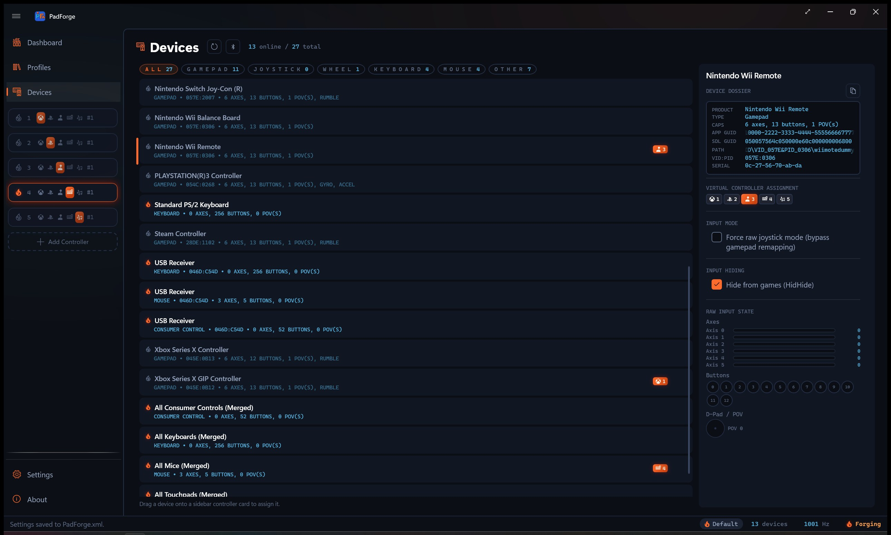

### The Joy-Con 2 is a mouse. So use it like one.

A Nintendo Switch 2 Joy-Con has an optical sensor on its face. Set it on a desk and slide it. Two new sources, Mouse Motion X and Mouse Motion Y, drive a stick for mouse-look, a button, or the scroll wheel, each with its own Sensitivity from 0.1 to 5.0. The right Joy-Con's IR camera also reports a brightness value you can map, so covering the sensor works like a button.


### Your keyboard's media keys, mapped.

The media row on a keyboard, a media remote, a headset's transport buttons: PadForge reads them as their own device with named button chips. Map Play/Pause, Mute, Volume, or Next and Previous Track to a virtual button or a macro trigger, same as any other input.


### See the charge. Sleep it when idle.

Every wireless pad that reports a battery shows its charge on the Devices page, with a charging glyph while it tops up. Set an Idle Disconnect timer and a Bluetooth controller drops its link after a few quiet minutes, so it sleeps instead of draining on the coffee table. A Disconnect Controller macro turns one off on command, from a chord or a button.


---

## PadForge vs other controller mappers

| | PadForge | x360ce | XOutput | reWASD | DS4Windows | Steam Input |
|---|:---:|:---:|:---:|:---:|:---:|:---:|
| Free | ✅ | ✅ | ✅ | $9.99+ | ✅ | ✅ |
| Open source | ✅ | ✅ | ✅ archived | ❌ | ✅ | ❌ |
| Works outside Steam | ✅ | ✅ | ✅ | ✅ | ✅ | only via Add Non-Steam Game |
| Actively developed | ✅ 2026 | no release since Nov 2020 | deprecated 2024 | ✅ v9.4 (2026) | ✅ v3.5 (Feb 2026) | ✅ |
| Xbox 360 virtual output | ✅ | ✅ | ✅ | ✅ | ✅ | ✅ |
| Xbox One / Series virtual output | ✅ | ❌ | ❌ | ✅ Xbox One | ❌ | ❌ |
| DualShock 4 virtual output | ✅ | ❌ | ❌ | ✅ | ✅ | ❌ |
| DualSense virtual output | ✅ | ❌ | ❌ | ❌ input only | ❌ | ❌ |
| Switch Pro virtual output | ✅ via HIDMaestro | ❌ | ❌ | ✅ | ❌ | ❌ |
| Flight stick / wheel / HOTAS virtual output (DirectInput) | ✅ 225+ HM profiles | ❌ | ❌ | ❌ | ❌ | ❌ |
| MIDI virtual output | ✅ | ❌ | ❌ | ❌ | ❌ | ❌ |
| MIDI input as a mapping source | ✅ notes / CC / pitch bend / encoders | ❌ | ❌ | ❌ | ❌ | ❌ |
| Keyboard + Mouse virtual output | ✅ | ❌ | ❌ | ✅ | ✅ | ✅ |
| Multi-source per row (one output, many inputs) | ✅ 6 combine modes + formula | ⚠️ "Combine Into" merges pads | ⚠️ MapperDataCollection (basic) | ❌ uses per-input Activators | ❌ | ⚠️ per-input Activators |
| Custom formula editor (arithmetic, logic, if-then-else) | ✅ drag-and-drop operators + 10 starter recipes | ❌ | ❌ | ❌ | ❌ | ❌ |
| Shift layers / modifier overlays | ✅ Hold / Toggle / Latch / Cycle / Sticky / No Button | ❌ | ❌ | ✅ up to 10 (Hold / Toggle / Custom) | ✅ Mode Shifts | ✅ Action Set Layers (stackable) |
| Cross-device chords (input on pad A + input on pad B) | ✅ | ❌ | ❌ | ✅ via Group of devices | ❌ | ❌ same controller only |
| Gyro mapping | ✅ Local / Player / World, RWC, Aim Engage | ❌ | ❌ | ✅ since v5.3 (curves, Flick Stick) | ✅ gyro-to-mouse, gyro-to-RS | ✅ |
| Xbox Impulse Trigger passthrough | ✅ + DualSense AT Vibration auto-route | ❌ | ❌ | ✅ Xbox One output only | ❌ | ❌ |
| Constant trigger force | ✅ | ❌ | ❌ | ❌ | ❌ | ❌ |
| Audio-bass trigger rumble | ✅ | ❌ | ❌ | ❌ | ❌ | ❌ |
| Audio-bass body rumble | ✅ | ❌ | ❌ | ❌ | ❌ | ❌ |
| DualSense Adaptive Triggers | ✅ 7 modes + GameCube preset | ❌ | ❌ | ✅ 11 presets | ⚠️ limited | ❌ |
| DualSense lightbar | ✅ 15 modes inc. Strobe + Battery | ❌ | ❌ | ✅ 6 modes + Player LED + Mic LED | ⚠️ basic, no audio | ⚠️ unverified |
| Controller speaker audio (DualSense / DualShock 4) | ✅ mirror Windows audio + macro sounds, USB / BT | ❌ | ❌ | ❌ | ❌ | ❌ |
| Touchpad: joystick / D-pad / mouse + gesture engine | ✅ joystick (anchor-relative), wedge D-pad, per-axis mouse (sensitivity + invert), in-box gestures (4-way / 8-way swipes, taps, longpress, pinch, rotate, two- to five-finger), shape templates (Circle in either direction, Square, Triangle, Z, Checkmark), custom recorded shapes | ❌ | ❌ | ⚠️ touchpad-as-mouse / -as-stick + click, no gesture engine | ⚠️ touchpad-as-mouse + four-direction Touchpad Swipe bindings | ⚠️ joystick / D-pad / mouse / touch menu, no multi-finger or shape recognition |
| HID PID 1.0 force feedback (wheels) | ✅ | ✅ constant + periodic (DirectInput) | ⚠️ basic passthrough only | ❌ | ❌ | ❌ |
| Native wheel FFB protocol (Logitech / Fanatec / Thrustmaster) | ✅ + rotation range, auto-center, RPM LEDs | ❌ | ❌ | ❌ | ❌ | ❌ |
| DSU / Cemuhook motion server (Cemu, Dolphin, Yuzu, Ryujinx) | ✅ | ❌ | ❌ | ✅ port 26760 | ✅ | ❌ |
| Phone as controller | ✅ in-browser, no app install, up to 16 phones at once, touchpad layout included | ❌ | ❌ | ⚠️ reWASD Mobile app (one phone, no touchpad layout) | ❌ | ❌ |
| Share a controller with another PC's games over a network | ✅ Remote Link, both directions, feedback returns | ❌ | ❌ | ❌ | ❌ | ❌ |
| Per-app profile switching | ✅ | ✅ since v4.17.12 (Nov 2020) | ❌ | ✅ Autodetect | ✅ | ✅ per-game by design |
| Max simultaneous virtual controllers | 16 | 4 (hard-coded PAD1-4 in UI) | 4 (UI matches XInput slot indices) | 4 (Slot UI cap) | 4 (Output Slots UI cap) | 1 per physical pad |
| 1000 Hz polling | ✅ | ⚠️ unverified | ⚠️ unverified | ✅ user-selectable 500 / 1000 Hz | ✅ on USB DS4 | ⚠️ unverified |
| 3D + 2D controller visualization | ✅ | ⚠️ 2D Xbox 360 only | ❌ | ⚠️ 2D only | ⚠️ basic | ⚠️ configurator preview |
| Multi-point sensitivity curve editor | ✅ unlimited points | ⚠️ single slider | ⚠️ deadzone only | ✅ custom 4-point | ⚠️ preset curves | ✅ response curves |
| 2026 Steam Controller support | ✅ via SDL3 fork | ❌ | ❌ | ⚠️ unverified | ❌ | ✅ |
| Wii Remote / Nunchuk / Classic / Wii U Pro as a source | ✅ all four forms, in-app pairing | ❌ | ❌ | ✅ in-app pairing (v9.4+) | ❌ | ❌ |

Comparison reflects each tool's shipping release at the time of this README. Verified against each project's own docs and source: x360ce v4.17.15.0 changelog; XOutput README + 3.x source; reWASD help.rewasd.com (v9.4); ds4windowsapp/DS4Windows v3.5; Steamworks Documentation (Action Set Layers / Activators / Mode Shifting / Input Source Modes). ⚠️ means the feature exists but is limited or unverified at the level of detail PadForge implements it.

---

## Quick start

1. Download `PadForge.exe` from the [latest release](https://github.com/hifihedgehog/PadForge/releases/latest).
2. Run it. PadForge always runs elevated, so Windows shows the UAC prompt at startup. The first launch installs HIDMaestro inside that same elevated session.
3. Click **Add Controller** on the Dashboard. Pick Xbox, PlayStation, Extended, MIDI, or Keyboard + Mouse.
4. On the new slot, drag a physical device onto it from the sidebar.
5. Most controllers auto-map on assign. For the rest, click **Map All** to walk every button in one pass, or use the **Mappings** tab to bind one at a time.
6. Launch your game. The game sees the virtual controller as real hardware.

Most games "just work" after step 5. If a game sees both your physical and virtual controller at once, install HidHide from **Settings → Drivers** to hide the physical one.

---

## Screenshots

### Dashboard

Polling rate, device count, every virtual controller slot, DSU motion server, web controller server, and driver health on one screen.

### 3D controller visualization
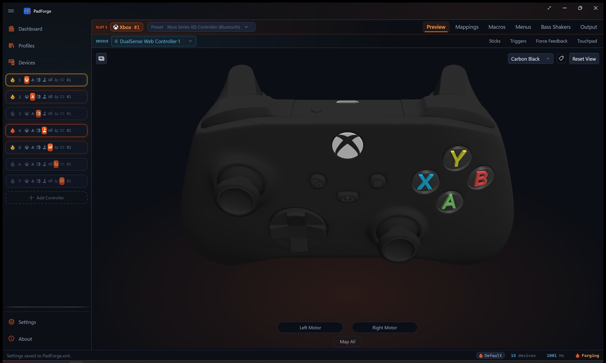
Interactive 3D model per profile. Rotate, zoom, pan. Buttons, sticks, and triggers highlight while you press them. Xbox Series profiles add a clickable Share button.

### 2D controller visualization
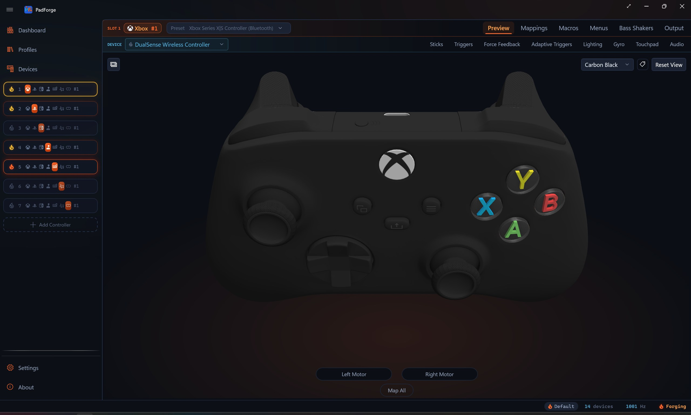
Flat schematic of the same controller, same live state. Useful on small monitors or for streaming overlays.

### Button and axis mappings

Record a binding by pressing a button. Pick from a dropdown of every available input (including raw HID buttons past the standard 11). Set Invert, Half-axis, or a per-mapping threshold for axis-to-button activation. A Primary Mode dropdown picks how the source reads: Direct, Incremental, Invert On Hold, or Ramp. Ramp turns an Up key and a Down key into a smooth axis, tuned by Attack, Release, Reverse, and Autocenter.

### Stick deadzones
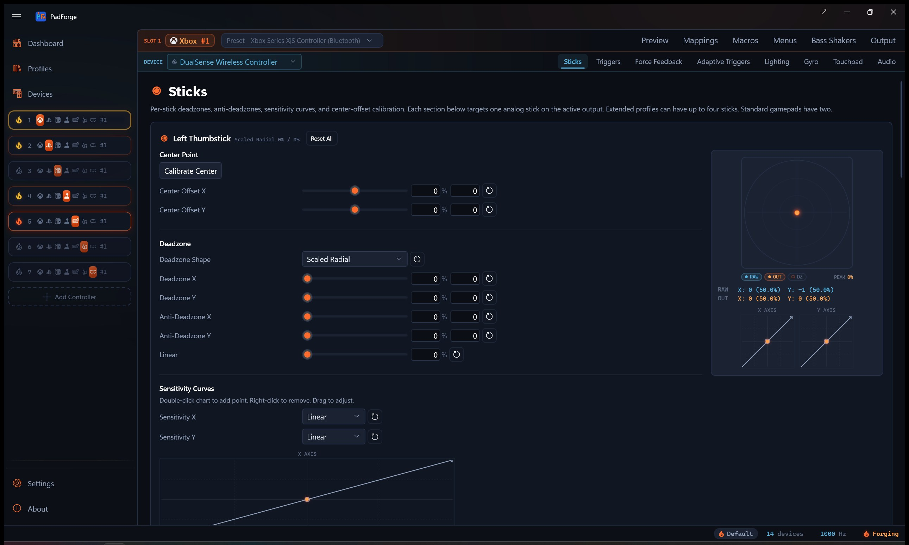
Six deadzone shapes (Scaled Radial, Radial, Axial, Hybrid, Sloped Scaled Axial, Sloped Axial). Per-axis deadzone, anti-deadzone, linear response, center calibration, and a custom sensitivity-curve editor with unlimited draggable points.

### Trigger deadzones

Floor and ceiling per trigger. Anti-deadzone. Sensitivity curves. Live value bars at 0.1% precision.

### Force feedback and rumble

Per-motor strength, overall gain, motor swap. Live motor activity bars. Audio Bass Rumble captures system audio, isolates bass through a 48 dB/octave filter, and pushes it to the rumble motors. Music feels physical even when the game is silent.

### Trigger routing
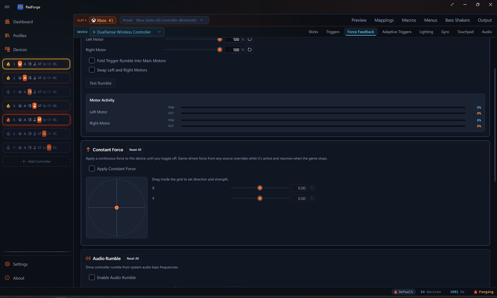
Send the main rumble motors into the trigger motors, one trigger at a time. Duplicate keeps the main motor running, Redirect silences it. Each trigger has its own Source, a 0-200% Scale, and an optional button Activator. Reaches Xbox impulse triggers and DualSense Adaptive Trigger Vibration.

### Wheel

Native force feedback for Logitech, Fanatec, and Thrustmaster wheels: constant force plus spring, damper, and friction from the game. Set rotation range in degrees, auto-center strength, and the RPM shift LEDs. Other force-feedback wheels still work through the generic path.

### DualSense Adaptive Triggers

Seven trigger effect modes. Off, Feedback, Weapon, Vibration, Multi-Position Feedback, Slope Feedback, Multi-Position Vibration. A live preview draws the resistance and amplitude curve while you drag Range, Strength, and Frequency. One-click GameCube preset loads parameters that mimic the click of a real GameCube trigger.

### DualSense lightbar

Fifteen lightbar modes including three Audio Pulse variants and three Audio Bands variants that react to system audio in real time. Three Input Reactive variants flash on button presses (Random Color, Cycle Through Palette, Base Color). Strobe is a square-wave flash at the period you set. Battery paints the bar by charge level (red at low, yellow at mid, green at full). Plus the indicator-LED card for player pattern, mute LED, and brightness.

### Audio

Controller speaker output for the DualSense and DualShock 4. Pick a Windows audio output to mirror, route a slot's macro sounds to the pad, and set a master volume. DualSense over USB or Bluetooth, DualShock 4 over Bluetooth.

### Touchpad

Per-slot touchpad tuning on any source with a touchpad surface (DualSense, DualSense Edge, DS4, Web Controller, on-screen Touchpad Overlay, Windows Precision Touchpad). Five cards: Stick / D-Pad Output (anchor-relative virtual stick + wedge D-pad), Mouse Output (per-axis sensitivity and invert), Gesture Detection (master enable + cooldown), In-Box Gestures (swipes, taps, longpress, pinch, rotate, two- to five-finger, shape templates), Custom Gestures (recorded shape templates per profile).

### Macros
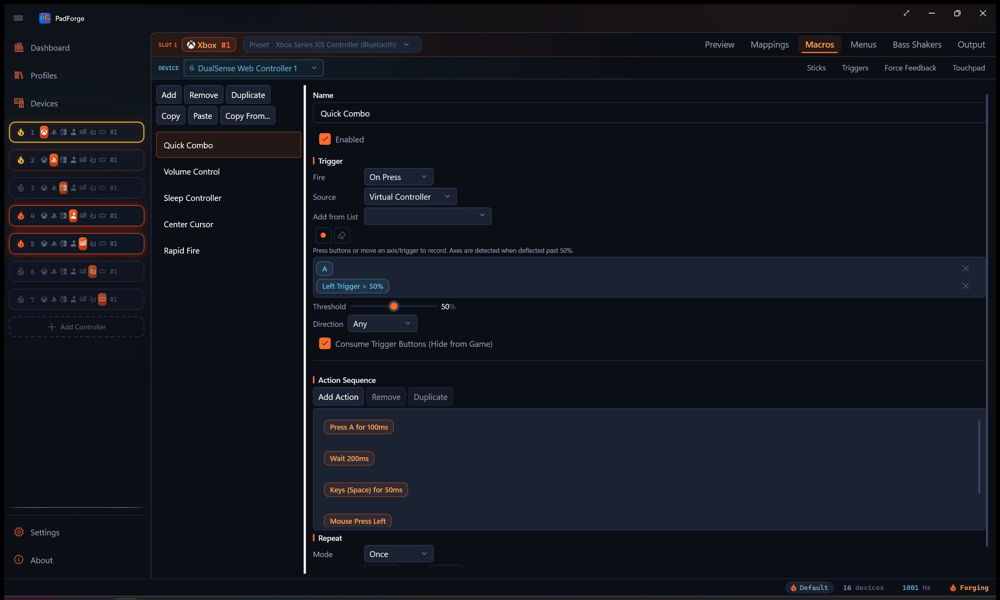
Combo triggers from buttons, axes, and POV directions. Action sequences with key presses, mouse moves, scroll, delays, system volume, app volume, lightbar overrides, and rumble overrides. Five fire modes (on press, on release, while held, always, custom formula). A macro toolbar duplicates a macro, copies and pastes it into another virtual controller, and pulls every macro from another controller in one step. Mouse-cursor actions snap the pointer to center (Recenter Mouse), pin it at a coordinate (Fix Mouse Position), or fence it inside a rectangle (Limit Mouse Region).

### Per-app profiles
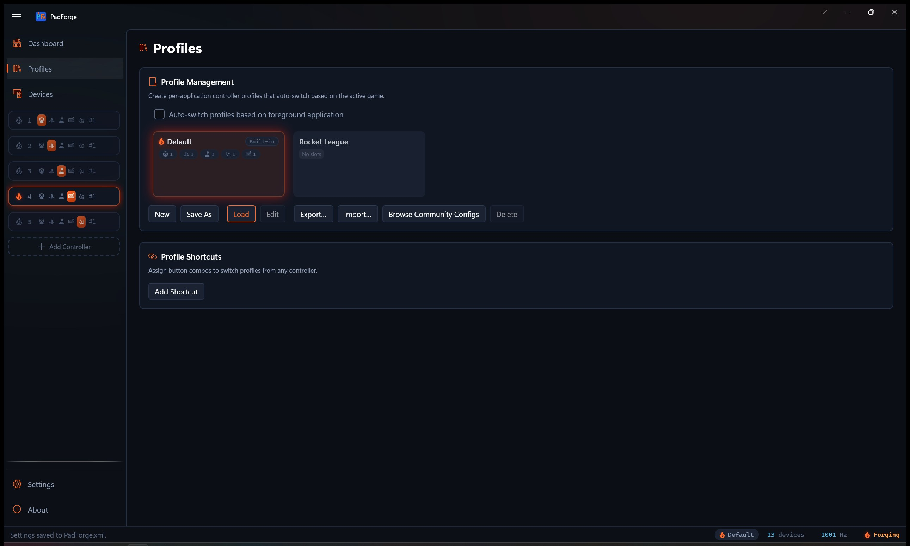
Each profile holds its own mappings, deadzones, force feedback, lighting, and macros. PadForge watches the foreground window and switches profiles automatically when a matching app gains focus. Controller-shortcut combos cycle profiles without touching the keyboard.

### Keyboard + Mouse virtual controller
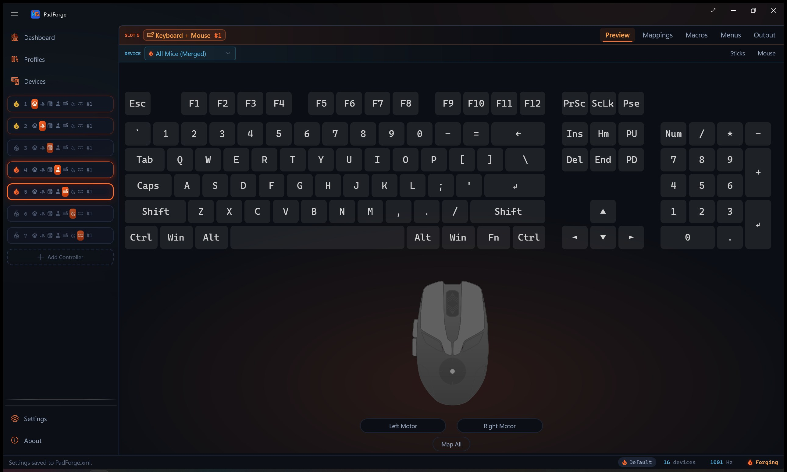
Map a controller stick to mouse movement. Map face buttons to WASD. The preview lights up every mapped key and mouse button in real time.

### Extended virtual controller

Flight sticks, racing wheels, HOTAS, third-party gamepads. 225+ HIDMaestro profiles plus a Custom mode that builds a HID descriptor from scratch. Up to 8 axes, 128 buttons, 4 POV hats. Configurable VID, PID, and product string.

### PlayStation virtual controller
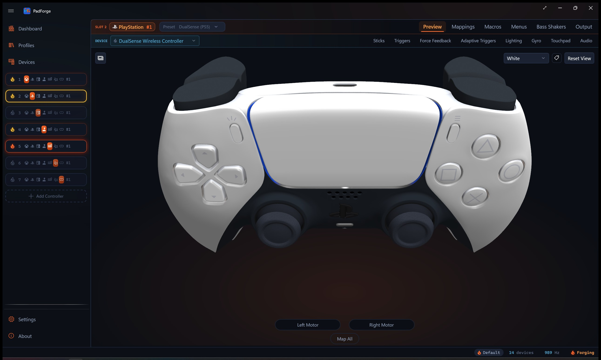
DualShock 4, DualSense, and DualSense Edge through HIDMaestro. Source gyro, accelerometer, touchpad, and battery passed through to the game.

### MIDI virtual controller

Channel 1-16. Configurable CC mapping, note mapping, and velocity. Axes send Control Change. Buttons send Note On / Off. No loopMIDI required. PadForge creates its own system endpoint via Windows MIDI Services.

### MIDI input

A MIDI keyboard or pad controller as a mapping source. Notes, Control Change, pitch bend, and encoder dials bind like buttons and axes. Same Windows MIDI Services stack as the virtual output.

### Add controller
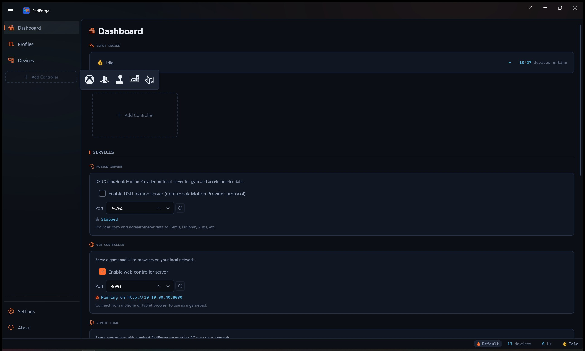
Pick the virtual controller type. Buttons dim when you hit the per-type limit.

### Devices

Every detected gamepad, joystick, keyboard, mouse, and touchpad as a card. Live raw axes, buttons, POV compass, gyro / accelerometer values, and touchpad finger positions for the selected device. Per-device HidHide toggle and Force Raw Joystick mode for when SDL3 guesses the gamepad layout wrong.

### Web controller

Connect a phone or tablet over Wi-Fi. Browser shows an Xbox 360 layout, a DualShock 4 layout, or a multi-touch touchpad layout with virtual sticks, D-pad, triggers, and rumble. Touch the sticks to push them. Tap to click.

### Remote Link

Pair your PCs and share their controllers every way. A wheel on one drives a game on another, with rumble, force feedback, adaptive triggers, lightbar, player LEDs, and speaker audio returning to the physical pad. Pair each pair once with a six-digit code. Trusted PCs reconnect on their own.

### Settings
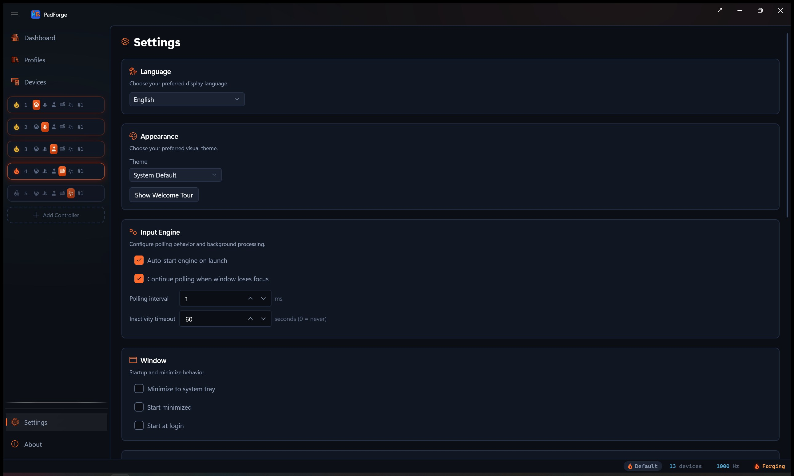
Language (10 locales, live-switch with no restart). Theme (System / Light / Dark). Polling interval (1-16 ms). Auto-start at login, minimize to tray, master input-hiding toggle.

---

## Known limits

- PadForge runs elevated so it can install and manage the HIDMaestro driver. Non-elevated games still read the virtual controllers normally.
- HidHide's device hiding is global per user account, not per-game.
- MIDI input and the MIDI virtual controller both need Windows MIDI Services (Windows 11 24H2 / build 26100 or later). On older systems neither appears.

---

## Requirements

Windows 10 or 11 on x64. The [.NET 10 Desktop Runtime](https://dotnet.microsoft.com/download/dotnet/10.0) is bundled in the single-file release, so there is nothing else to install.

### Drivers

PadForge installs **HIDMaestro** on first run. HIDMaestro is the engine that creates virtual controllers. Add a slot and HIDMaestro spins up a HID device matching the controller "shape" you picked.

Two more drivers are optional. PadForge offers to install each one only when you need its feature:

| Driver | Install when |
|---|---|
| [HidHide](https://github.com/nefarius/HidHide) | A game sees both your physical and virtual controller at once |
| [Windows MIDI Services](https://github.com/microsoft/MIDI) | You want MIDI input or the MIDI virtual controller |

**OpenXInput** is bundled inside `PadForge.exe`. No separate install. It filters PadForge's own virtual controllers out of its own XInput view so device enumeration stays clean.

---

## Build from source

```bash
dotnet publish PadForge.App/PadForge.App.csproj -c Release
```

Output: `PadForge.App/bin/Release/net10.0-windows10.0.26100.0/win-x64/publish/PadForge.exe`

See [BUILD.md](BUILD.md) for project structure, architecture notes, and developer reference. See the [wiki](https://github.com/hifihedgehog/PadForge/wiki) for deeper dives into the input pipeline, virtual controller backends, settings file format, and visualization renderer.

---

## Don't see your controller in the picker?

PadForge's controller picker is the set of HIDMaestro profiles that ship with a captured HID descriptor. A few controllers are missing their captures, so they don't appear yet. If you own one of those controllers, you can capture it yourself from inside PadForge. No extra tools, no admin.

To capture and use a profile locally:

1. Create or open any **Extended**-type slot.
2. On the Controller page, click **Imported profiles…** on the Extended config bar.
3. Under **Connected devices available to import**, pick your plugged-in device and click **Import**.
4. The new profile appears in the slot's dropdown with a "(User Generated)" suffix and stays available across every Extended slot from then on.

Profiles live inside `PadForge.xml` and travel with your settings.

To share a captured profile upstream:

1. In the same dialog, select your imported profile under **Your imported profiles**.
2. Click **Export…** and save the JSON.
3. Open a [profile contribution issue on HIDMaestro](https://github.com/hifihedgehog/HIDMaestro/issues/new?template=profile-contribution.yml) and attach the file. Once merged, the profile ships in the next HIDMaestro release for everyone.

To import a profile someone else captured:

1. Click **Import from file…** in the same dialog and pick the `.json` they sent you.

PadForge reads only the HID descriptor during capture. It does not record or forward your controller's input.

---

## Built on the work of these projects

PadForge stands on these projects. Please consider supporting them directly.

| Project | Role | License |
|---|---|---|
| [x360ce](https://github.com/x360ce/x360ce) | Original codebase this fork started from | MIT |
| [SDL3](https://github.com/libsdl-org/SDL) | Controller input: joystick, gamepad, and sensor enumeration | zlib |
| [HIDMaestro](https://github.com/hifihedgehog/HIDMaestro) | User-mode UMDF2 virtual HID controller engine with 225+ device profiles | MIT |
| [OpenXInput](https://github.com/hifihedgehog/OpenXinput) | Drop-in `xinput1_4.dll` replacement that filters PadForge's own virtual controllers from its own XInput view | upstream trademark disclaimer |
| [Handheld Companion](https://github.com/Valkirie/HandheldCompanion) | 3D controller OBJ meshes (Xbox 360, Xbox One, DualShock 4, DualSense) | CC BY-NC-SA 4.0 |
| [Gamepad-Asset-Pack](https://github.com/AL2009man/Gamepad-Asset-Pack) | 2D controller PNG schematics (Xbox 360, Xbox One S, Xbox Series, DualShock 4, DualSense) | MIT |
| [HelixToolkit](https://github.com/helix-toolkit/helix-toolkit) | 3D viewport rendering for WPF | MIT |
| [WPF UI](https://github.com/lepoco/wpfui) | Fluent 2 design system for WPF | MIT |
| [CommunityToolkit.Mvvm](https://github.com/CommunityToolkit/dotnet) | MVVM data binding framework | MIT |
| [NAudio.Wasapi](https://github.com/naudio/NAudio) | WASAPI loopback capture for audio-bass rumble | MIT |
| [HidHide](https://github.com/nefarius/HidHide) | Per-device hiding driver to prevent double input | MIT |
| [BthPS3](https://github.com/nefarius/BthPS3) | Bundled Bluetooth profile driver + PSM filter that lets a DualShock 3 connect. PadForge installs it in-app at pairing time and the radio stays shared | BSD 3-Clause |
| [DsHidMini](https://github.com/nefarius/DsHidMini) | DualShock 3 protocol reference: sixpair feature reports, Bluetooth output-report template, enable ordering, battery map | BSD 3-Clause |
| [Nefarius.Utilities.DeviceManagement](https://github.com/nefarius/Nefarius.Utilities.DeviceManagement) | Driver-store install, Bluetooth class filter registration, and USB port cycling for the in-app BthPS3 setup | MIT |
| [Windows MIDI Services](https://github.com/microsoft/MIDI) | Virtual MIDI device SDK | MIT |
| [$Q Recognizer](https://depts.washington.edu/acelab/proj/dollar/qdollar.html) | Touchpad shape-template matcher: re-derived C# port of the canonical JS reference by Magrofuoco / Vatavu / Anthony / Wobbrock | BSD 3-Clause |
| [GestureSign](https://github.com/TransposonY/GestureSign) | Touchpad angular-margin matcher: scoring approach re-derived from GestureSign's PointPatternAnalyzer | BSD 3-Clause |
| [Concentus](https://github.com/lostromb/concentus) | Pure C# Opus encoder for DualSense speaker audio over Bluetooth, by Logan Stromberg | BSD 3-Clause |
| [SAxense](https://apps.sdore.me/SAxense) | DualSense Bluetooth audio research by [egormanga](https://github.com/egormanga/SAxense): the packet transport the controller speaker stream rides on | MPL-2.0 |
| [dualsense-bt-haptics](https://github.com/awalol/dualsense-bt-haptics) | Bluetooth speaker recipe by awalol: Opus framing and packet layout (HeadsetPlayMusic) | MIT |
| [DualSenseY-v2](https://github.com/WujekFoliarz/DualSenseY-v2) | Reference implementation for USB controller audio passthrough and adaptive trigger effects, by WujekFoliarz | none published |
| [dualsense-tester](https://github.com/daidr/dualsense-tester) | Browser DualSense test suite by Xuezhou Dai ([ds.daidr.me](https://ds.daidr.me/)): reference for the Sony feature-report CRC framing and firmware test commands PadForge forwards from virtual to physical pads | MIT |
| [DS4AudioStreamer](https://github.com/nefarius/DS4AudioStreamer) | DualShock 4 Bluetooth audio reference by nefarius: report 0x14/0x17 framing, frame counter, and volume-enable layout for PadForge's DS4 speaker stream. PadForge's SBC encoder is an original C# implementation from the Bluetooth A2DP specification (no libsbc code) | MIT |
| [ds4mac documentation](https://github.com/khallmark/ds4mac) | DualShock 4 audio protocol documentation: SBC parameters, packet layouts, and the finding that DS4 audio is Bluetooth-only | MIT |
| [Bouncy Castle](https://github.com/bcgit/bc-csharp) | Remote Link pairing and transport cryptography: X25519, Ed25519, ChaCha20-Poly1305 | MIT-style |
| [libusb](https://github.com/libusb/libusb) | USB access library the bundled SDL3 fork uses for the Switch 2 Pro wired driver. Ships unmodified as `libusb-1.0.dll` beside the exe | LGPL-2.1 |
| [nipplejs](https://github.com/yoannmoinet/nipplejs) | Touch joystick widget in the phone Web Controller, by Yoann Moinet | MIT |
| [SDL_GameControllerDB](https://github.com/mdqinc/SDL_GameControllerDB) | Community gamepad mapping database that PadForge's bundled mapping file extends | zlib |
| [Zacksly Icon Pack](https://zacksly.itch.io/) | Stick and trigger tab icon artwork PadForge's icon geometry derives from, by Zacksly | CC BY 3.0 |
| [xbledctl](https://github.com/Leclowndu93150/xbledctl) | Xbox Guide button LED brightness: the `\\.\XboxGIP` interface research and LED packet layout PadForge's writer derives from | MIT |
| [JoyShockMapper](https://github.com/Electronicks/JoyShockMapper) | Winding-angle steering and lean math, ported to C# for the 2D-steering sources, by JibbSmart and Electronicks | MIT |
| [GamepadMotionHelpers](https://github.com/JibbSmart/GamepadMotionHelpers) | Player-space and world-space gyro conversion PadForge's gyro aim ports, by JibbSmart | MIT |
| [SteamControllerSinger](https://github.com/Roboron3042/SteamControllerSinger) | Steam Controller (2015) haptic feature-report layout and note-period math, by Pila and Roboron3042 | BSD 3-Clause |
| [SteamHapticsSinger](https://github.com/CrazyCritic89/SteamHapticsSinger) | Steam Controller 2026 and Steam Deck LFO-tone haptic report layout and gain tables | BSD 3-Clause |
| [hitboxer](https://github.com/valignatev/hitboxer) | SOCD-cleaning semantics reference for the Keyboard & Mouse Snap Tap modes, by valignatev | MIT |
| [Dolphin](https://github.com/dolphin-emu/dolphin) | Wii controller documentation: the Bluetooth pairing ceremony's Win32 call order and the Wii Remote speaker's Yamaha ADPCM constants. Documentation only, no GPL code ships | GPL-2.0 |
| [DS4Windows](https://github.com/Ryochan7/DS4Windows) | DualShock behavior documentation: idle-disconnect slop, touchpad boundaries, battery decode. Documentation only, no GPL code ships | GPL-3.0 |
| [xone](https://github.com/medusalix/xone) / [xow](https://github.com/medusalix/xow) | GIP LED command documentation corroborating xbledctl. Documentation only, no GPL code ships | GPL-2.0 |
| [WiimoteLib](https://github.com/BrianPeek/WiimoteLib) | Wii IR camera and Balance Board behavior documentation | Ms-PL |
| [joycon-singer](https://github.com/Sergey004/joycon-singer) | Joy-Con HD-rumble wire-format documentation, cross-checked against dekuNukem's research. Facts only | none published |
Special thanks to [TechAntohere](https://github.com/TechAntohere) (u/Idkiamaguy645) for sharing his DualSense Bluetooth findings and testing, and for pointing PadForge to the working speaker recipe.

---

## Donations

Knowing PadForge is useful is reward enough. If you truly insist on donating, please donate to your charity of choice and bless humanity. If you can't think of one, consider [Humanitarian Services of The Church of Jesus Christ of Latter-day Saints](https://philanthropies.churchofjesuschrist.org/humanitarian-services). Also consider donating directly to the upstream projects above. They made all of this possible.

**My promise:** PadForge will never become paid, freemium, or Patreon early-access paywalled. Free means free.

---

## License

This project is licensed under **CC BY-NC-SA 4.0** (Creative Commons Attribution-NonCommercial-ShareAlike 4.0 International).

- **3D controller models** adapted from [Handheld Companion](https://github.com/Valkirie/HandheldCompanion) (CC BY-NC-SA 4.0). Copyright (c) CasperH2O, Lesueur Benjamin, trippyone.
- **2D controller assets** from [Gamepad-Asset-Pack](https://github.com/AL2009man/Gamepad-Asset-Pack) (MIT), by AL2009man.
- **Original codebase** forked from [x360ce](https://github.com/x360ce/x360ce) (MIT).
- **SDL3** is licensed under the [zlib License](https://github.com/libsdl-org/SDL/blob/main/LICENSE.txt).
- **HIDMaestro** is licensed under the MIT License.
- **WPF UI** is licensed under the MIT License.
- **Windows MIDI Services** is licensed under the MIT License.
- **HidHide** is licensed under the MIT License.
- **BthPS3** is licensed under the BSD 3-Clause License. Copyright (c) 2018-2026, Nefarius Software Solutions e.U. PadForge bundles the Microsoft-attestation-signed BthPS3 and BthPS3PSM driver binaries unmodified and installs them on demand for DualShock 3 Bluetooth support. Full license text in [LICENSE](LICENSE).
- **DsHidMini** is licensed under the BSD 3-Clause License. Copyright (c) 2020-2025, Benjamin Höglinger-Stelzer. Protocol reference for the DualShock 3 (sixpair feature reports, Bluetooth output-report template, enable ordering, battery status map). PadForge's implementation is original C#.
- **Nefarius.Utilities.DeviceManagement** is licensed under the MIT License. By nefarius. Driver-store installation, device class filters, and USB hub port cycling for the DualShock 3 driver setup.
- **DualShock 3 Bluetooth research** also drew on [ScpToolkit](https://github.com/nefarius/ScpToolkit), [sixad](https://github.com/RetroPie/sixad), and [transbt](https://github.com/null-dev/transbt) (all GPL) as protocol documentation only. PadForge's pairing and reader code is original C# and contains no GPL code.
- **OpenXInput** ships only an upstream Microsoft-trademark disclaimer (no OSS license grant). Redistributed as-is under the same terms.
- **$Q Recognizer** is licensed under the BSD 3-Clause License. Copyright (c) 2018-2019, Nathan Magrofuoco, Jacob O. Wobbrock, Radu-Daniel Vatavu, and Lisa Anthony. The touchpad shape-matcher in PadForge.Engine.Touchpad.ShapeRecognizer is a C# re-derivation of the canonical JavaScript reference at depts.washington.edu/acelab/proj/dollar/qdollar.js.
- **GestureSign's PointPatternAnalyzer** is licensed under the BSD 3-Clause License. Copyright (c) 2016, TransposonY. The angular-margin scoring in PadForge.Engine.Touchpad.AngularMarginRecognizer is a C# re-derivation of that approach.
- **Concentus** is licensed under the BSD 3-Clause License (the Opus license). By Logan Stromberg, with copyrights held by Skype Limited, Xiph.Org Foundation, and other Opus contributors.
- **DualSense Bluetooth speaker audio** builds on research by egormanga ([SAxense](https://apps.sdore.me/SAxense), MPL-2.0), awalol ([dualsense-bt-haptics](https://github.com/awalol/dualsense-bt-haptics), MIT), and [TechAntohere](https://github.com/TechAntohere). PadForge's implementation is original C#.
- **DualSenseY-v2** by WujekFoliarz served as the behavioral reference for USB controller audio passthrough. It publishes no license. PadForge's implementation is original C#.
- **dualsense-tester** is licensed under the MIT License. Copyright (c) 2023 Xuezhou Dai (daidr). Reference for the Sony Bluetooth feature-report CRC framing and vendor test commands. PadForge's implementation is original C#.
- **DS4AudioStreamer** is licensed under the MIT License. By nefarius. Reference for the DualShock 4 Bluetooth audio report framing. PadForge's SBC encoder is an original C# implementation from the public Bluetooth A2DP specification and contains no libsbc (GPL) code.
- **ds4mac** documentation is licensed under the MIT License. By khallmark. Protocol reference for DualShock 4 audio.
- **NAudio** is licensed under the MIT License. By Mark Heath and contributors. WASAPI loopback capture for the controller-audio mirror and the audio-bass trigger rumble.
- **Bouncy Castle** (bc-csharp) provides the Remote Link pairing and transport cryptography (X25519, Ed25519, ChaCha20-Poly1305). Licensed under the Bouncy Castle Licence, an adaptation of the MIT License.
- **libusb** is licensed under the LGPL-2.1-or-later. PadForge ships the unmodified `libusb-1.0.dll` beside the exe as a separately replaceable dynamic library. Source: [github.com/libusb/libusb](https://github.com/libusb/libusb). Full license text in [LICENSE](LICENSE).
- **nipplejs** is licensed under the MIT License. Copyright (c) 2014 Yoann Moinet. The Web Controller's touch joystick.
- **SDL_GameControllerDB** is licensed under the zlib License. PadForge's bundled `gamecontrollerdb_padforge.txt` extends it and keeps the source citation in its header.
- **Zacksly Icon Pack** is licensed under CC BY 3.0. By Zacksly ([zacksly.itch.io](https://zacksly.itch.io/)). PadForge's stick and trigger tab icon geometry derives from it.
- **xbledctl** is licensed under the MIT License. By Leclowndu93150. PadForge's Xbox Guide LED writer derives its `\\.\XboxGIP` packet layout and device-discovery sequence from it.
- **JoyShockMapper** and **GamepadMotionHelpers** are licensed under the MIT License. By JibbSmart (Julian Smart) and Electronicks. PadForge's winding-angle steering and player/world-space gyro conversions are C# ports.
- **SteamControllerSinger** (by Pila, Roboron3042) and **SteamHapticsSinger** (by Pila, Crazy, AAGaming) are licensed under the BSD 3-Clause License. PadForge's Steam Controller haptic tone encoder reproduces their report layouts and timing math in original C#.
- **hitboxer** is licensed under the MIT License. By valignatev. The SOCD-cleaning mode semantics reference. PadForge's state machine is original C#.
- **Wii and Xbox protocol documentation** also drew on [Dolphin](https://github.com/dolphin-emu/dolphin) (GPL-2.0), [DS4Windows](https://github.com/Ryochan7/DS4Windows) (GPL-3.0), [xone](https://github.com/medusalix/xone) and [xow](https://github.com/medusalix/xow) (GPL-2.0) as documentation only. PadForge's implementations are original C# and contain no GPL code.
- **WiimoteLib** (Ms-PL, by Brian Peek) and **joycon-singer** (no license published, by Sergey004) served as behavior documentation for the Wii IR camera, Balance Board, and Joy-Con HD rumble. Facts only, no code copied.
See [LICENSE](LICENSE) for the full license text.
